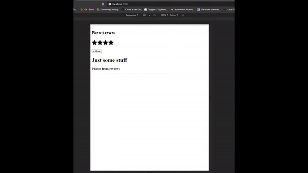

# forgEtsy_FullStack
Proxy and service oriented architecture (SOA) project that utilized micro-services to develop a modular clone of the popular e-commerce site, “Etsy”

    
    

#container img {
    vertical-align:middle;
    max-height:100%;
}
